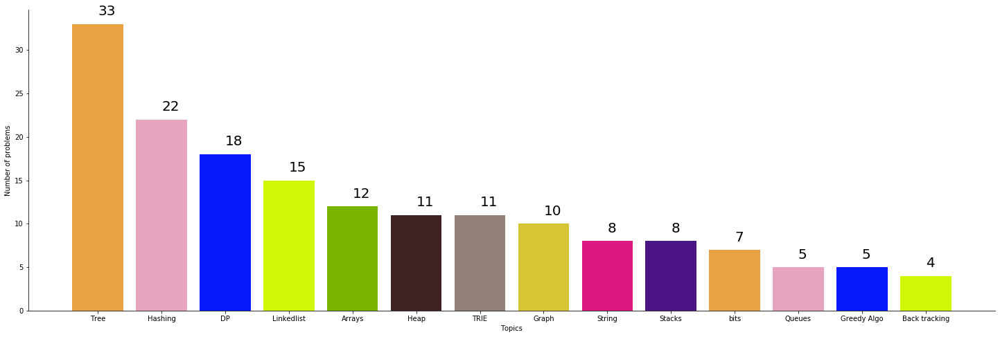
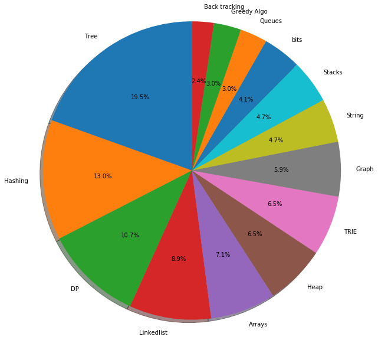
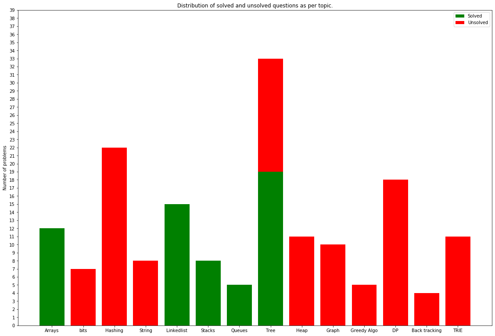

# Algorithm-of-the-day
This repository contains codes fro few excellent cources and plateforms. This repostiory is created with focus on interview preparation. I will be updating codes regularly.

# Tracks:
#### 1. Course | Geeks Classes

Course URL: [Geeks Classes](https://practice.geeksforgeeks.org/courses/geeks-classes)

Description:

An extensive classroom program to build and enhance Data Structures and Algorithm.

##### Problems Distribuations:
###### Problem Count            

###### Problem % Distribuations

##### Progress:

